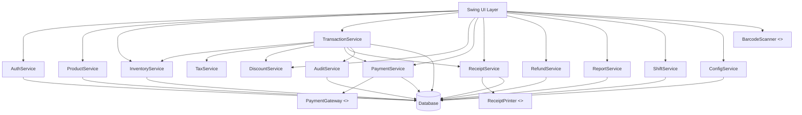
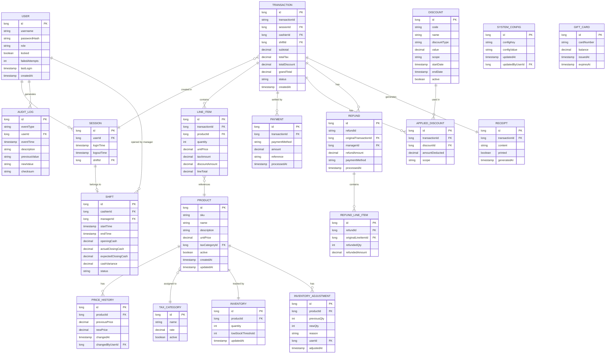

# Design Document: Java POS System

## Overview

The Java POS (Point of Sale) System is a desktop retail application built on Java 17+ using a layered architecture. It serves cashiers, managers, and administrators in a retail store environment, handling real-time transaction processing, inventory management, multi-method payment acceptance, receipt generation, and reporting.

The system runs as a standalone Java application with a Swing-based GUI, backed by an embedded or local relational database (H2 for development / MySQL or PostgreSQL for production). Hardware integration (barcode scanner, receipt printer) is managed through abstraction layers to keep the core domain logic hardware-agnostic.

Key design goals:
- **Reliability**: All financial operations are atomic and durable.
- **Correctness**: Tax, discount, and payment calculations are exact (using `BigDecimal`).
- **Security**: Role-based access control, hashed passwords, tamper-evident audit logs.
- **Extensibility**: Payment gateways and hardware devices are pluggable via interfaces.
- **Performance**: All user-facing lookups complete within the latency bounds specified in requirements.

---

## Architecture

The application follows a **3-tier layered architecture**:

```
┌─────────────────────────────────────────────────────┐
│                  Presentation Layer                  │
│  (Swing UI: Login, Cart, Product, Report, Config)    │
└────────────────────┬────────────────────────────────┘
                     │ calls
┌────────────────────▼────────────────────────────────┐
│                  Service Layer                       │
│  (AuthService, TransactionService, InventoryService, │
│   PaymentService, ReportService, ReceiptService,     │
│   DiscountService, TaxService, ShiftService,         │
│   AuditService, ProductService, ConfigService)       │
└────────────────────┬────────────────────────────────┘
                     │ uses
┌────────────────────▼────────────────────────────────┐
│                  Repository Layer                    │
│  (JPA/JDBC Repositories for each domain entity)     │
└────────────────────┬────────────────────────────────┘
                     │ persists to
┌────────────────────▼────────────────────────────────┐
│                  Database                            │
│  (H2 embedded / MySQL / PostgreSQL)                  │
└─────────────────────────────────────────────────────┘
```

### Cross-cutting concerns

- **Audit Logging** — an `AuditInterceptor` wraps service calls to capture all critical events automatically.
- **Session Context** — a thread-local `SessionContext` carries the currently authenticated user throughout a request.
- **Transaction Management** — database transactions are managed declaratively via a `TransactionManager` wrapper around JDBC, ensuring atomicity for multi-table writes.
- **Hardware Abstraction** — `BarcodeScanner` and `ReceiptPrinter` interfaces decouple hardware drivers from business logic.

---

## Components and Interfaces

### Mermaid Component Diagram



### Service Interfaces

```java
// Authentication
public interface AuthService {
    AuthResult login(String username, String password);
    void logout(long userId);
    void unlockAccount(long userId, long adminId);
}

// Product management
public interface ProductService {
    Product createProduct(ProductDto dto);
    Product updateProduct(long productId, ProductDto dto);
    void deleteProduct(long productId);           // soft-delete
    List<Product> search(String query);
    ImportResult importFromCsv(Path csvPath);
}

// Inventory
public interface InventoryService {
    void adjustInventory(long productId, int delta, String reason, long userId);
    InventoryReport generateInventoryReport();
    List<Product> getLowStockProducts();
}

// Transaction
public interface TransactionService {
    Cart getActiveCart(long sessionId);
    LineItem addItem(long sessionId, String sku, int qty);
    void removeItem(long sessionId, long lineItemId);
    void updateQuantity(long sessionId, long lineItemId, int qty);
    TransactionSummary calculateTotals(long sessionId);
    CompletedTransaction completeTransaction(long sessionId, List<PaymentEntry> payments);
    void voidTransaction(long sessionId);
}

// Discount
public interface DiscountService {
    void applyDiscountCode(long sessionId, String code);
    List<Promotion> getActivePromotions();
    void createPromotion(PromotionDto dto);
}

// Tax
public interface TaxService {
    BigDecimal calculateLineTax(LineItem item);
    BigDecimal calculateTransactionTax(List<LineItem> items);
    List<TaxCategory> getAllCategories();
}

// Payment
public interface PaymentService {
    PaymentResult processPayment(PaymentEntry entry, BigDecimal grandTotal);
    BigDecimal calculateChange(BigDecimal tendered, BigDecimal grandTotal);
}

// Receipt
public interface ReceiptService {
    Receipt generateReceipt(CompletedTransaction txn);
    void printReceipt(Receipt receipt);
    void emailReceipt(Receipt receipt, String emailAddress);
    Receipt getReceiptByTransactionId(String transactionId);
}

// Refund
public interface RefundService {
    TransactionDetail lookupTransaction(String transactionId);
    RefundResult processRefund(RefundRequest request, long managerId);
}

// Reporting
public interface ReportService {
    DailySalesReport getDailySalesReport(LocalDate date);
    ProductSalesReport getProductSalesReport(LocalDate from, LocalDate to);
    CashierPerformanceReport getCashierReport(long cashierId, LocalDate from, LocalDate to);
    ShiftSummaryReport getShiftSummaryReport(long shiftId);
    Path exportReportAsCsv(Report report);
}

// Shift
public interface ShiftService {
    Shift openShift(long cashierId, BigDecimal openingCash, long managerId);
    ShiftSummaryReport closeShift(long shiftId, BigDecimal actualCash, long managerId);
}

// Audit
public interface AuditService {
    void log(AuditEvent event);
    List<AuditEntry> search(AuditSearchCriteria criteria);
}

// Configuration
public interface ConfigService {
    SystemConfig getConfig();
    void updateConfig(ConfigDto dto);
}
```

### Hardware Abstraction Interfaces

```java
public interface BarcodeScanner {
    void startListening(Consumer<String> onSkuScanned);
    void stopListening();
}

public interface ReceiptPrinter {
    PrintResult print(Receipt receipt);
    boolean isAvailable();
}

public interface PaymentGateway {
    GatewayResponse authorize(CardPaymentRequest request);
}
```

---

## Data Models

### Entity Relationship Diagram



### Core Java Domain Classes

```java
// User and access
public record User(long id, String username, String passwordHash, Role role,
                   boolean locked, int failedAttempts, Instant lastLogin) {}

public enum Role { CASHIER, MANAGER, ADMINISTRATOR }

// Product
public record Product(long id, String sku, String name, String description,
                      BigDecimal unitPrice, long taxCategoryId, boolean active) {}

// Cart (in-memory, tied to a Session)
public class Cart {
    private final long sessionId;
    private final List<CartLineItem> lineItems = new ArrayList<>();
    private final List<AppliedDiscount> discounts = new ArrayList<>();

    public BigDecimal getSubtotal() { ... }
    public BigDecimal getTotalTax() { ... }
    public BigDecimal getTotalDiscount() { ... }
    public BigDecimal getGrandTotal() { ... }
}

public record CartLineItem(long productId, String productName, String sku,
                           int quantity, BigDecimal unitPrice, BigDecimal taxRate,
                           boolean taxExempt, List<AppliedDiscount> lineDiscounts) {
    public BigDecimal getPreTaxTotal() { return unitPrice.multiply(BigDecimal.valueOf(quantity)); }
    public BigDecimal getTaxAmount() { ... }
    public BigDecimal getLineTotal() { ... }
}

// Transaction
public record CompletedTransaction(String transactionId, long cashierId,
                                   long shiftId, List<LineItem> lineItems,
                                   List<PaymentEntry> payments,
                                   BigDecimal subtotal, BigDecimal totalTax,
                                   BigDecimal totalDiscount, BigDecimal grandTotal,
                                   Instant completedAt, TransactionStatus status) {}

public enum TransactionStatus { COMPLETED, VOIDED, REFUNDED, PARTIALLY_REFUNDED }

// Payment
public record PaymentEntry(PaymentMethod method, BigDecimal amount, String reference) {}
public enum PaymentMethod { CASH, CREDIT_CARD, DEBIT_CARD, GIFT_CARD }

// Discount
public record Discount(long id, String code, String name, DiscountType type,
                       BigDecimal value, DiscountScope scope,
                       LocalDate startDate, LocalDate endDate) {}
public enum DiscountType { PERCENTAGE, FIXED_AMOUNT }
public enum DiscountScope { LINE_ITEM, TRANSACTION }

// Tax
public record TaxCategory(long id, String name, BigDecimal rate) {}

// Audit
public record AuditEntry(long id, AuditEventType eventType, long userId,
                         Instant eventTime, String description,
                         String previousValue, String newValue, String checksum) {}
```

---

## Correctness Properties

*A property is a characteristic or behavior that should hold true across all valid executions of a system — essentially, a formal statement about what the system should do. Properties serve as the bridge between human-readable specifications and machine-verifiable correctness guarantees.*

### Property 1: Grand total is non-negative

*For any* cart with any combination of line items and applied discounts, the calculated grand total SHALL never be negative; the minimum grand total is zero.

**Validates: Requirements 5.7, 4.6**

---

### Property 2: Tax calculation linearity

*For any* list of line items, the total transaction tax computed by `TaxService` SHALL equal the sum of individually computed taxes for each line item.

**Validates: Requirements 6.3**

---

### Property 3: Inventory atomicity on transaction completion

*For any* completed transaction, the inventory quantity of each purchased product SHALL decrease by exactly the purchased quantity, and the sum of inventory decrements across all line items SHALL equal the total units sold in that transaction.

**Validates: Requirements 3.1, 14.2**

---

### Property 4: Refund restores inventory

*For any* refund of any subset of line items from a completed transaction, each refunded product's inventory quantity SHALL increase by exactly the refunded quantity.

**Validates: Requirements 3.2, 9.4**

---

### Property 5: Cash payment change calculation correctness

*For any* cash payment amount greater than or equal to the grand total, the change due SHALL equal the tendered amount minus the grand total, and this value SHALL always be non-negative.

**Validates: Requirements 7.3, 7.4**

---

### Property 6: Discount code validation — no invalid discounts applied

*For any* discount code input (expired, unknown, or malformed), the cart's applied discounts list SHALL remain unchanged after a failed application attempt.

**Validates: Requirements 5.5**

---

### Property 7: Password hashing — no plaintext storage

*For any* user account creation or password update, the stored credential in the database SHALL never equal the plaintext password provided during the operation.

**Validates: Requirements 1.8**

---

### Property 8: Audit log completeness for critical events

*For any* execution of a critical system action (login, logout, transaction completion, void, refund, product create/update/delete, inventory adjustment, discount application, shift open/close), exactly one audit log entry SHALL be created containing a non-null event type, user ID, and timestamp.

**Validates: Requirements 12.1, 12.2**

---

### Property 9: Split payment settlement completeness

*For any* completed transaction using split payments, the sum of all payment amounts SHALL equal the transaction grand total.

**Validates: Requirements 7.2**

---

### Property 10: Tax-exempt products incur zero tax

*For any* line item whose product is marked tax-exempt, the computed tax amount SHALL be zero regardless of the assigned tax category rate.

**Validates: Requirements 6.5**

---

## Error Handling

### Strategy

All errors are classified into three tiers:

| Tier | Description | Handling Strategy |
|------|-------------|-------------------|
| **User errors** | Invalid input, out-of-stock, expired codes | Display descriptive message in UI; do not propagate to logs |
| **System errors** | DB write failures, printer unavailable, gateway timeout | Roll back affected operation, display error to user, log to audit trail |
| **Fatal errors** | Missing critical config, DB connection lost at startup | Display blocking error screen; prevent system from reaching login |

### Key Error Scenarios

**Payment gateway timeout/decline**
- The `PaymentService` wraps gateway calls in a retry-with-timeout policy (configurable, default 30 s).
- A declined response leaves the transaction in `PENDING` state; the cashier is prompted to try another payment method.
- The transaction is only marked `COMPLETED` after all payments are fully authorized.

**Database write failure during transaction completion**
- The `TransactionService` wraps the full commit (transaction header + line items + payments + inventory updates) in a single JDBC transaction.
- On any `SQLException`, the full transaction is rolled back.
- The error is surfaced to the cashier and written to the audit log with the failure reason.

**Receipt printer unavailable**
- `ReceiptService.printReceipt()` catches `PrinterUnavailableException`.
- The receipt is saved to the database in serialized form.
- The cashier sees a retry button; re-attempting print does not re-process the transaction.

**Account lockout**
- `AuthService` increments `failedAttempts` on each failed login within a JDBC transaction.
- On the third failure, `locked = true` is set atomically.
- Locked accounts can only be unlocked by an Administrator; the unlock action is audit-logged.

**Empty cart checkout attempt**
- Validated in `TransactionService.completeTransaction()` before any payment processing begins.
- Returns a `ValidationException` which the UI translates to a non-blocking error message.

**Out-of-stock item addition**
- `TransactionService.addItem()` checks `Inventory.quantity > 0` before adding.
- Returns `OutOfStockException` if the check fails; the item is not added to the cart.

**CSV import partial failures**
- `ProductService.importFromCsv()` processes each row independently.
- Invalid rows are skipped; each skip is recorded in an `ImportErrorLog` with the row number and reason.
- The method returns an `ImportResult` containing success count, failure count, and the error log.

---

## Testing Strategy

### Dual Testing Approach

The system uses both **unit/integration tests** and **property-based tests** to achieve comprehensive coverage.

#### Unit and Integration Tests

- **Framework**: JUnit 5 + Mockito
- **Scope**: Service layer logic with mocked repositories, UI integration with TestFX, database integration with H2 in-memory

Unit tests focus on:
- Specific examples demonstrating correct behavior (e.g., a known cart total computes correctly)
- Integration points between services (e.g., `TransactionService` calls `InventoryService` on completion)
- Error conditions and edge cases (e.g., empty cart, locked account)
- Hardware adapter behavior under simulated failure conditions

#### Property-Based Tests

- **Framework**: [jqwik](https://jqwik.net/) (Java property-based testing library built on JUnit 5)
- **Minimum iterations**: 100 per property
- **Tag format**: `@Tag("Feature: java-pos-system, Property {N}: {property_text}")`

Each correctness property from the design document is implemented as a single `@Property` test in jqwik.

**Property test examples:**

```java
// Property 1: Grand total is non-negative
@Property(tries = 200)
@Tag("Feature: java-pos-system, Property 1: Grand total is non-negative")
void grandTotalIsNeverNegative(
    @ForAll @Size(min = 1, max = 20) List<@Positive BigDecimal> prices,
    @ForAll @Size(min = 0, max = 5) List<@Positive BigDecimal> discounts
) {
    Cart cart = buildCart(prices);
    discounts.forEach(d -> applyFixedDiscount(cart, d));
    assertThat(cart.getGrandTotal()).isGreaterThanOrEqualTo(BigDecimal.ZERO);
}

// Property 2: Tax calculation linearity
@Property(tries = 200)
@Tag("Feature: java-pos-system, Property 2: Tax calculation linearity")
void transactionTaxEqualsLineTaxSum(
    @ForAll @Size(min = 1, max = 30) List<CartLineItem> items
) {
    BigDecimal sumOfLineTaxes = items.stream()
        .map(taxService::calculateLineTax)
        .reduce(BigDecimal.ZERO, BigDecimal::add);
    BigDecimal transactionTax = taxService.calculateTransactionTax(items);
    assertThat(transactionTax).isEqualByComparingTo(sumOfLineTaxes);
}

// Property 5: Cash change correctness
@Property(tries = 500)
@Tag("Feature: java-pos-system, Property 5: Cash payment change calculation correctness")
void changeIsAlwaysNonNegativeWhenTenderedCoversTotal(
    @ForAll @Positive BigDecimal grandTotal,
    @ForAll @Positive BigDecimal extraAmount
) {
    BigDecimal tendered = grandTotal.add(extraAmount);
    BigDecimal change = paymentService.calculateChange(tendered, grandTotal);
    assertThat(change).isGreaterThanOrEqualTo(BigDecimal.ZERO);
    assertThat(change).isEqualByComparingTo(extraAmount);
}
```

#### Test Coverage Targets

| Layer | Target Coverage |
|-------|----------------|
| Service layer (pure logic) | ≥ 85% line coverage |
| Repository layer | ≥ 70% (integration tests with H2) |
| UI layer | Key workflows covered by TestFX smoke tests |
| Property tests | All 10 correctness properties implemented |

#### Performance Tests

- Barcode scan → cart add: verified under 500 ms with a mock scanner sending 1000 SKUs sequentially.
- Product search: verified under 1 s with a 10,000-product dataset.
- Report generation (31-day range): verified under 5 s with 100,000 transaction records.

#### Security Tests

- Verify no plaintext passwords appear in any database column, log file, or exported CSV.
- Verify audit log entries cannot be deleted or modified via any application interface.
- Verify all role-based access checks reject unauthorized roles with the correct error.
